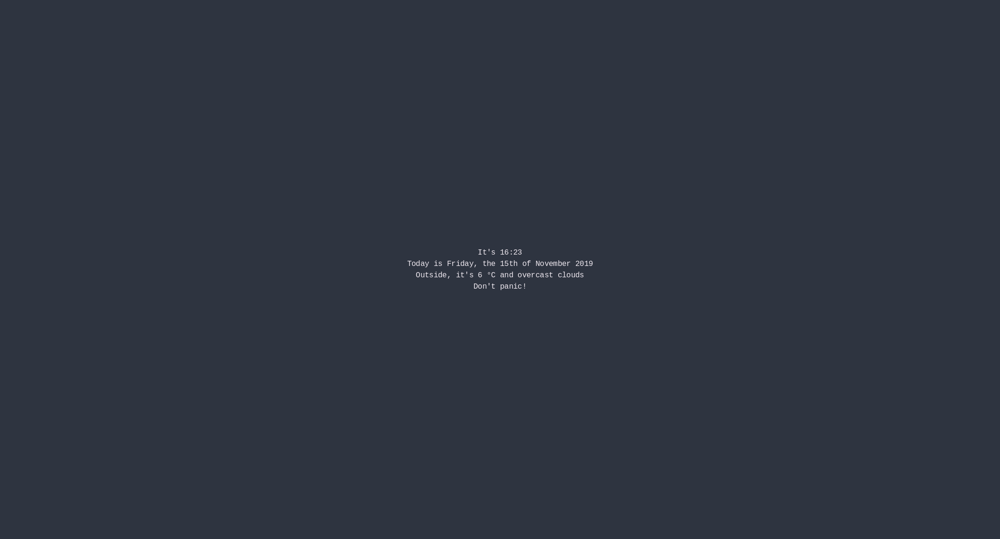

# Startpage

This is a *very* minimal startpage.

It is build with flask, and intended to be run as a local website, so that you can use it on all your devices.

## Config

To configure the startpage, you can create the file `config.yaml` in the startpage directory. Have a look at the [default config](./defaultconfig.yaml) to see the available options.

## Setup

Run `python3 startpage.py` (after installing all required packages with `pip3 install -r requirements.txt`). 
